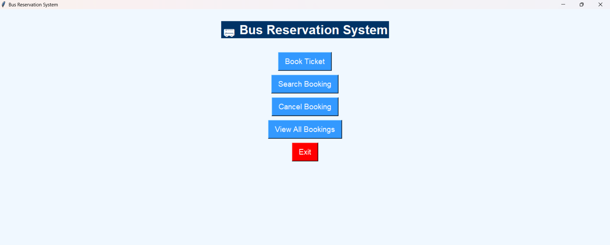

# 🚌 Bus Reservation System

A desktop **Bus Reservation System built with Python, Tkinter, and SQLite**.  
The application provides a simple interface for searching buses, checking seat availability, booking tickets, viewing bookings, and cancelling reservations.

## ✨ Features

- 🔎 Search available buses
- 💺 Check seat availability
- 🎫 Book bus tickets
- 📋 View existing bookings
- ❌ Cancel reservations
- 🗃️ Store reservation data using SQLite
- 🖥️ Tkinter-based desktop GUI
- ⚡ Lightweight and easy to run locally

## 🛠️ Technologies

| Technology | Purpose |
|---|---|
| Python | Application logic |
| Tkinter | Graphical user interface |
| SQLite | Local database |
| sqlite3 | Python database interface |

## 📁 Project Structure

```text
BUS-RESERVATION-SYSTEM-USING-PYTHON/
│
├── BusReservationSystem/
│   ├── bus_reservation.py
│   └── bus_reservation.db
│
├── .github/
│   ├── ISSUE_TEMPLATE/
│   │   ├── bug_report.md
│   │   └── feature_request.md
│   └── pull_request_template.md
│
├── CODE_OF_CONDUCT.md
├── CONTRIBUTING.md
├── LICENSE
├── README.md
└── SECURITY.md
```

## 🚀 Getting Started

### Prerequisites

Install Python 3.

```bash
python --version
```

Tkinter and SQLite are normally included with standard Python installations.

### Run the Project

1. Clone the repository:

```bash
git clone https://github.com/gurusaeth12/BUS-RESERVATION-SYSTEM-USING-PYTHON.git
```

2. Enter the repository:

```bash
cd BUS-RESERVATION-SYSTEM-USING-PYTHON
```

3. Open the application folder:

```bash
cd BusReservationSystem
```

4. Run:

```bash
python bus_reservation.py
```

## 🖥️ Application Workflow

```text
Search Bus
    ↓
Check Seat Availability
    ↓
Book Ticket
    ↓
Save Booking in SQLite
    ↓
View Booking / Cancel Booking
```

## 🗄️ Database

The application uses SQLite for local storage. The included database file is used by the reservation application to store its local booking data.

## 📸 Project Preview

Add screenshots of the **actual application** to the repository, for example:

```markdown

```

Recommended screenshots:
- Main application window
- Bus search
- Seat availability
- Ticket booking
- Booking details
- Cancellation

> Replace `screenshot.png` with an actual screenshot before publishing.

## 🎯 Learning Objectives

This project demonstrates practical use of:

- Python programming
- Tkinter GUI development
- SQLite database operations
- CRUD-style operations
- User input handling
- Desktop application development

## 🔮 Future Improvements

- User login and registration
- Admin dashboard
- Bus schedule management
- Automatic ticket generation
- Online payment integration
- Email/SMS confirmation
- Improved seat-selection interface
- Cloud database support

## 🤝 Contributing

Contributions are welcome!

Please read **[CONTRIBUTING.md](CONTRIBUTING.md)** before submitting changes.

## 🐛 Issues

Found a bug or have an improvement idea?

Use the repository's GitHub **Issues** section. Issue templates are provided for:

- Bug reports
- Feature requests

## 🔐 Security

For security-related issues, please read **[SECURITY.md](SECURITY.md)** and avoid publicly posting sensitive vulnerability details.

## 📜 Code of Conduct

Please read **[CODE_OF_CONDUCT.md](CODE_OF_CONDUCT.md)** to understand the expected community behavior.

## 📄 License

This project is distributed under the license included in this repository.

---

⭐ If you find this project useful, consider giving it a star!
